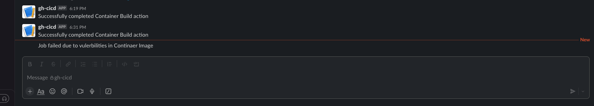

## CICD by GH-Action

### Workflow
*   Standard single Image build with vulnerbilities scanner
*   Allow to specific application build from multiple application from single repository - in this it sets defined folder as current context and build image based on its Dockerfile
  
These Github action builds application container image based on Dockerfile. While building Image it goes through triviy image scanner for vulnerbilities analaysis, if it founds CRITICAL,HIGH non fixable vulnerbilities,it stops the build process and notify user on slack channel else it does produce build and push artifacts to container registry with slack notfication for process completion/

### Pre-requisites

* Configure secrets based repository
    * Slack webhook url for notifications
    * Container registry authentication access details
  
### Integration with Slack to get notifications

